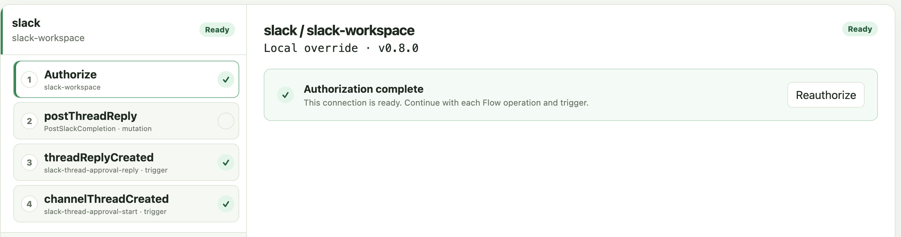

# Dex Connectors Library

[Dex main repository](https://github.com/superdurable/dex) ·
[Documentation](https://docs.superdurable.io) ·
[Connector directory](https://superdurable.github.io/dex-connectors-library/)

## Overview

[](https://superdurable.github.io/dex-connectors-library/)

Dex Connectors Library is the open-source boundary between Dex Flows and
external providers. Credentials stay outside durable Flow state. Provider call
identity comes from Dex Step execution identity, and every provider outcome is
explicit.

The directory lists each published connector, its company, reusable UI units,
triggers, and operations. Search matches all of those names and descriptions.

## Contribute a connector

Use the official
[Dex Connector Contributor skill](https://github.com/superdurable/dex-skills/blob/main/dex-connector-contributor/SKILL.md)
to add or modify a connector, operation, Trigger, or configuration UI unit.
The skill guides an agent through provider public APIs or official SDKs,
manifest-first code generation, a connector-local runnable example, complete
testing, and an upstream pull request. It also discovers or helps create the
contributor's GitHub fork before checking it out locally.

Invoke it through the `superdurable-dex` plugin:

- Codex: `$dex-connector-contributor`
- Claude Code: `/superdurable-dex:dex-connector-contributor`
- Cursor: `/dex-connector-contributor`

See the [Dex Skills installation guide](https://github.com/superdurable/dex-skills#install)
for plugin setup and the complete contribution workflow.

## Use a connector

A Connector is a versioned integration package, not just an API operation. It
can own authentication and connection configuration, provider reads and
writes, provider event ingress, typed routing into Dex, and reusable setup UI.
Applications keep only a logical connection name; credentials remain in the
Connector runtime and never enter Flow state or a configuration UI unit.

| Capability | Purpose |
| --- | --- |
| Query operation | Read provider state from a typed Connector Step. |
| Mutation operation | Change provider state with idempotency and explicit uncertainty handling. |
| Trigger | Receive and normalize provider events with stable event identity and at-least-once delivery. |
| Flow Trigger target | Filter and map a Trigger event into a new typed Flow execution. |
| Flow RPC and RPC Trigger target | Define a typed method on an existing Flow, then filter and map a Trigger event into it. |
| Configuration UI unit | Let Dex Web compose connector-owned controls for non-secret operation or Trigger configuration. |

### Query operation

A Query reads provider state. The operation-specific factory creates a typed
Dex Step; the application maps the current Flow value to provider input and
connects the successful result branch to the next Step. Provider work runs in
the Connector Step's `Execute` method.

For example, the Slack thread approval Flow reads one bounded page of thread
messages and routes the `Read` result to `threadLoaded`:

```go
dex.DefineStep(slack.NewListThreadMessagesStep(slack.ListThreadMessagesStepConfig[Input]{
	StepType:       readThreadStepType,
	ConnectionName: ConnectionName,
	Annotations: sdkgo.StepAnnotations{
		GroupID: "slack", GroupLabel: "Slack",
		Explanation: "Read the messages in the newly created Slack thread.",
	},
	Connection: flow.connection,
	MapToOperationInput: func(input Input) slack.ListThreadMessagesInput {
		return slack.ListThreadMessagesInput{
			ChannelID: input.ChannelID, ThreadTimestamp: input.ThreadTimestamp,
			PageSize: 15,
		}
	},
	Read: sdkgo.GoTo(threadLoaded{}),
}))
```

### Mutation operation

A Mutation changes provider state. It uses the same typed Step boundary, but
its provider adapter also derives a stable idempotency key from the Dex call
identity. A conclusive provider outcome selects a branch; an ambiguous
post-dispatch outcome selects `uncertain` for reconciliation instead of being
blindly resent.

This Slack Mutation maps durable thread state into a reply and continues only
after Slack confirms the `Sent` branch:

```go
dex.DefineStep(slack.NewPostThreadReplyStep(slack.PostThreadReplyStepConfig[ThreadState]{
	StepType:       postCompletionStepType,
	ConnectionName: ConnectionName,
	Annotations: sdkgo.StepAnnotations{
		GroupID: "slack", GroupLabel: "Slack",
		Explanation: "Reply to the Slack thread after the reply Trigger invokes the RPC.",
	},
	Connection:     flow.connection,
	MapToOperationInput: func(state ThreadState) slack.PostThreadReplyInput {
		return slack.PostThreadReplyInput{
			ChannelID:       state.Input.ChannelID,
			ThreadTimestamp: state.Input.ThreadTimestamp,
			Text:            flow.postCompletionConfiguration.Value.Text,
		}
	},
	Sent: sdkgo.GoTo(completionPosted{}),
}))
```

### Trigger

A Trigger is a long-running provider ingress capability, separate from a Flow
Step. It validates and normalizes an external event, preserves the provider's
stable event ID and occurrence time, and delivers the event at least once. A
Trigger binding names one use of that event source and keeps its matcher
configuration separate from reusable connection credentials.

For example, this Flow definition declares one statically named use of Slack's
`channelThreadCreated` Trigger:

```go
slack.DefineChannelThreadCreatedTriggerBinding(
	slack.ChannelThreadCreatedTriggerBindingConfig{
		ConnectionName: ConnectionName,
		BindingName:    StartTriggerBinding,
	},
)
```

The Trigger itself does not decide whether an event starts a Flow or invokes an
RPC. The application chooses one of the following typed targets and supplies a
pure filter, Flow ID resolver, and input mapper.

### Flow Trigger target

A Flow Trigger target admits a provider event into a new Flow. The application
filter runs first, the resolver chooses the stable business Flow ID, and the
mapper produces the typed start input. Dex uses the stable provider event ID as
the start request identity so redelivery does not create another root start.

The Slack example routes a matching top-level channel message into a new thread
approval Flow:

```go
ChannelThreadCreatedRoutes: []slack.LocalChannelThreadCreatedTriggerRoute{{
	BindingName: threadapproval.StartTriggerBinding,
	Target: sdkgo.NewDexFlowTriggerTarget(
		client, flow, startTriggerFilter, threadapproval.ResolveFlowID,
		threadapproval.MapToFlowInput,
	),
}},
```

### Flow RPC and RPC Trigger target

A Flow RPC is an application-owned typed method for synchronously reading or
changing one existing Flow execution. An RPC Trigger target delivers a provider
event to that method. The same Flow ID resolver locates the execution, while an
RPC input mapper keeps the provider event type out of the application's RPC
contract. The application owns RPC registration, locks, business-state checks,
and bounded duplicate-event state.

The Slack Flow registers `ReceiveThreadReply` with an Attribute lock for the
state changed by the handler:

```go
dex.DefineRPC(flow.ReceiveThreadReply, &dex.RPCOptions{
	LockAttributes: []dex.AttributeLock{dex.LockAttribute(threadStateAttribute)},
})
```

The Trigger target passes that same bound method directly, routing an allowed
thread reply to the Flow started by the root message:

```go
ThreadReplyCreatedRoutes: []slack.LocalThreadReplyCreatedTriggerRoute{{
	BindingName: threadapproval.ReplyTriggerBinding,
	Target: sdkgo.NewDexRPCTriggerTarget(
		client, flow.ReceiveThreadReply, replyTriggerFilter,
		threadapproval.ResolveFlowID, threadapproval.MapToReceiveThreadReplyInput,
	),
}},
```

### Configuration UI unit

A configuration UI unit is a small connector-owned React control that Dex Web
composes for one operation or Trigger binding. Generated unit and port
constants connect the control to an application-owned configuration object
through JSON Pointers. The iframe receives only scoped non-secret values;
credentials and provider tokens remain host-owned.

For example, Slack's reusable `textInput` unit configures the completion reply
used by `PostThreadReply`:

```go
ConfigurationUI: sdkgo.ConnectorConfigurationUI{Units: []sdkgo.ConnectorUIUnit{{
	ID: "completionText", UnitID: slack.UIUnitTextInput,
	Label: "Completion reply", Required: true,
	Bindings: []sdkgo.ConnectorUIBinding{{
		Port: slack.UITextInputPortText, JSONPointer: "/text",
	}},
}}},
```

Slack also composes `channelPicker`, `memberPicker`, and `textInput` units for
its two Trigger bindings, so Dex Web stores stable provider IDs without
exposing credentials to those controls.

### End-to-end Slack example

Follow the [Slack thread approval walkthrough](connectors/slack/examples/thread-approval/README.md)
to configure Slack and Dex Web, run the example Worker, and verify the complete
path: a top-level Slack message starts a Flow, the Flow reads the thread, an
allowed reply invokes its typed RPC, and the Connector posts the completion
reply. The [complete Flow source](connectors/slack/examples/thread-approval/flow/workflow.go)
shows how the Steps, triggers, and RPC are wired together.

In Dex Web, open **Connections**, select `slack / slack-workspace`, and choose
**Authorize**. Then configure each Flow use in the left panel: set the
`postThreadReply` **Completion reply**, configure both trigger bindings, and
choose **Save** in each unit. A green check marks saved setup. In the screenshot,
authorization and both triggers are ready; `postThreadReply` is the remaining
item to configure before starting the example Worker.



## Organization

The first folder under `connectors/` is the company name, matches
`metadata.company`, and contains `logo.svg`. Connectors for the same company
are grouped below that folder, such as `connectors/google/gmail` and
`connectors/google/spreadsheet`.

Each connector is its own Go module. Release tags use the module directory,
such as `connectors/github/vX.Y.Z` and `connectors/google/gmail/vX.Y.Z`.
The manifest `metadata.version` is the release version. The root
`connectors.yaml` registry is the source for the public catalog.

- [Connector contract](docs/connector-contract.md)
- [Architecture](docs/architecture.md)
- [Manifest authoring](docs/manifest-authoring.md)
- [Versioning and releases](docs/versioning-and-releases.md)
- [Acceptance](docs/acceptance.md)
